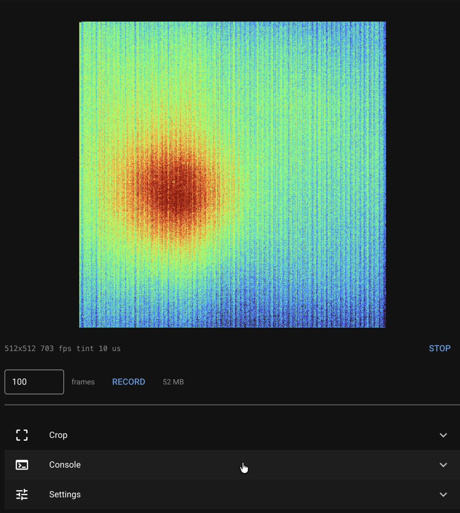

# C-RED Camera Control

A web app for running a First Light Imaging C-RED camera from a Jetson over the
simplified USB SDK. Live preview, serial console, crop picker, and recording to
`.raw`.

The Jetson runs headless, so the app serves a page on the network. Open it from
a laptop or a phone.



---

## What you need

- Python 3.10 or newer. NiceGUI 3.x requires it. JetPack 6 ships 3.10.
- The FLI simplified USB SDK at
  `/opt/first_light_imaging/fliusbsdk/lib/libfliusbsdk.so`, or set
  `FLI_USB_SDK_LIB` to wherever it is.

```bash
pip3 install -r requirements.txt
```

`nicegui`, `numpy` and `pyserial` are required. Pillow is optional. OpenCV is
not used.

### Permissions

A udev rule avoids running the app as root:

```bash
lsusb                                   # get the camera's vendor ID
echo 'SUBSYSTEM=="usb", ATTR{idVendor}=="XXXX", MODE="0666"' \
  | sudo tee /etc/udev/rules.d/99-fli-camera.rules
sudo udevadm control --reload-rules && sudo udevadm trigger
sudo usermod -aG dialout $USER          # for /dev/ttyACM0
```

Log out and back in.

If you run with `sudo` instead, install the dependencies system-wide with
`sudo pip3 install -r requirements.txt`. Root does not see packages installed
with `pip3 install --user`.

### USB buffer

Raise it or you will drop frames:

```bash
sudo sh -c 'echo 1000 > /sys/module/usbcore/parameters/usbfs_memory_mb'
```

Add `usbcore.usbfs_memory_mb=1000` to the kernel command line to keep it across
reboots.

---

## Running

```bash
python3 main.py
```

It connects, sets free-running mode, reads the geometry, starts streaming, and
prints one address:

```
C-RED camera control on http://192.168.128.17:8080
```

| Flag | What it does |
| --- | --- |
| `--sim` | synthetic frames, no camera needed |
| `--no-auto` | do not connect or start on launch |
| `--port 8080` | web server port |
| `--host 127.0.0.1` | Jetson only, no LAN |
| `--sdk <path>` | path to `libfliusbsdk.so` |
| `--show` | open a local browser, needs a display |
| `--reload` | restart on source changes |
| `--verbose` | also print the SDK's INFO messages |

Ctrl-C stops it cleanly. `--sim` gives you the whole app with synthetic frames
and a mock `fli-cli`, which is the easiest way to try it without hardware.

---

## The interface

The image, a readout (`512x512  703 fps  tint 10 us`), and **Start/Stop** and
**Record**. The dot in the header is grey when disconnected, amber when idle,
green when streaming.

Three sections below that:

**Crop** — pick a window size and drag it. The grid is the camera's windowing
granularity, so anything you can draw is something the camera will take.
**Apply** sends it. Dragging on its own does not touch the camera.

**Console** — any `fli-cli` command. Enter sends, Up/Down for history.

**Settings** — port, baud, colormap, preview rate, display range, integration
time, output folder.

---

## Crop and frame rate

**Apply** sends five commands:

```
set cropping columns 288-351
set cropping rows 224-287
set cropping on
set fps 9523
set tint 0.000010000
```

Three things about that order:

- The ranges only define the window. Without `set cropping on` the camera stays
  on the full frame. Full frame is `set cropping off`.
- Columns snap to 32, rows to 4.
- Tint goes last. Setting the frame rate makes the camera reset tint to about
  the frame period, so a tint sent earlier gets overwritten.

Rates come from a table, not from the camera. `maxfps` and `maxfpsusb` both
report higher than the sensor sustains, and asking for more than it can read
out gives you corrupt image tags instead of an error.

| Window | Frame period | Rate |
| --- | --- | --- |
| 64x64 | 105 us | 9523 fps |
| 128x128 | 210 us | 4761 fps |
| 256x256 | 420 us | 2380 fps |
| 512x512 | 1422 us | 703 fps |
| 640x512 | 1680 us | 595 fps |

The table is `FRAME_RATE` in `serial_console.py`.

---

## Recording

Set a frame count and press **Record**. The app stops whatever is running,
starts a fresh acquisition with tag checking on and the preview off, takes
exactly that many frames, and stops. The preview comes back afterwards.

Nothing else touches the camera during a capture. The burst is held in RAM
before it is written, so the size is shown while you pick.

Every recording prints a block to the terminal and writes a `.json` sidecar:

```
------------------------------------------------------------------
RECORDING  2026-08-27T12:56:52
  file        capture_1000f_512x512_703.00fps_20260827_125652.raw
  geometry    512 x 512  (524,288 bytes/frame)
  frames      1,000
  frame rate  703.000 fps requested, 701.4 measured
  duration    1.425 s  (stream only)
  start-up    0.912 s  (acquisition to first frame)
  tint        10.0 us
  size        524.3 MB
  tag check   clean - no dropped frames
  sidecar     capture_1000f_512x512_703.00fps_20260827_125652.json
  source      fli-usb-sdk
------------------------------------------------------------------
```

Pipe it if you want a log:

```bash
python3 main.py | tee -a ~/acquisitions.log
```

### Tag checking

The camera puts a frame counter in every frame. `fli_usb_checkTagEnable` turns
the SDK's check on, and that check is what prints `Invalid tag detected`.

Viewing runs with it off. A preview that misses a frame does not matter, and at
high rates the messages are constant. Recording runs with it on and reports the
result when the burst finishes.

### Raw files

Little-endian `uint16`, frames in order, each frame `height` rows of `width`
pixels, row-major, no header or padding. The camera fills the low 14 bits.

```python
from rawio import load_raw

frames = load_raw('capture.raw')     # (frames, height, width), memory-mapped
print(frames.shape, frames[0].mean())
```

Geometry comes from the sidecar.

---

## Command line

```bash
python3 serialCOM.py                       # fli-cli console
python3 serialCOM.py --list                # list serial ports
python3 acquire.py -N 100 out.raw          # geometry from the camera
python3 acquire.py -W 64 -H 64 -N 100 out.raw
python3 read_raw.py out.raw --stats 5 --tags --png frame0.png
```

All take `--sim`.

---

## Trigger mode

The camera keeps its trigger mode between sessions. If something left it in
external synchro it will open, start, and deliver nothing while it waits for a
trigger.

The app logs `extsynchro` and `swsynchro` on connect and turns both off before
acquiring. Turn **Free-run on start** off in Settings if you are using an
external trigger.

---

## Files

| File | What it does |
| --- | --- |
| `main.py` | arguments, page layout, `ui.run()` |
| `session.py` | shared state: camera, serial link, log, settings |
| `camera_sdk.py` | ctypes bindings |
| `camera.py` | frame buffer, recording, SDK and simulated cameras |
| `serial_console.py` | serial link, command formats, parsing, console |
| `camera_viewer.py` | live preview |
| `crop_panel.py` | crop picker |
| `capture_frames.py` | record to `.raw` |
| `settings_panel.py` | the Settings section |
| `imaging.py` | 16-bit scaling, colormaps, PNG encode |
| `rawio.py` | raw writing and loading, JSON sidecar |
| `simulator.py` | synthetic frames and a mock fli-cli |

`simulator.py` is there so the app runs without a camera. Delete it and
`SimulatedCamera` if you want hardware only.

If you extend this, keep the acquisition callback small. It runs on the SDK's
thread holding the GIL, every 105 us at full speed. And do not call
`fli_usb_exit()` — it tears down libusb while the SDK's threads may still be
using it.

---

## Troubleshooting

**SDK not found** — set `FLI_USB_SDK_LIB`, or use `--sim`.

**No serial ports** — check `/dev/ttyACM0` exists and that you are in the
`dialout` group.

**`fli_usb_startAcquisition` fails** — geometry has to match the camera's
cropping. Leave *From camera* on in Settings.

**Crop looks ignored** — the console log shows every command and reply. Check
whether `set cropping on` was accepted.

**Commands time out** — the console waits for the `fli-cli>` prompt and gives
up after 2 seconds. Check the baud rate (115200) and that nothing else has the
port open.

**Dropped frames on big windows only** — look at bandwidth, not frame rate.
`width x height x 2 x fps` against about 425 MB/s for a USB 3.0 link. Full
frame at full rate is close enough to the ceiling that a hub, or another device
on the same bus, will push it over. `lsusb -t` shows what the camera negotiated
and what it shares with. Recording at a lower rate is the reliable fix.

---

## License

MIT, see [LICENSE](LICENSE).

The FLI USB SDK is not included and is not covered by it. Get the SDK from
First Light Imaging under their terms.
